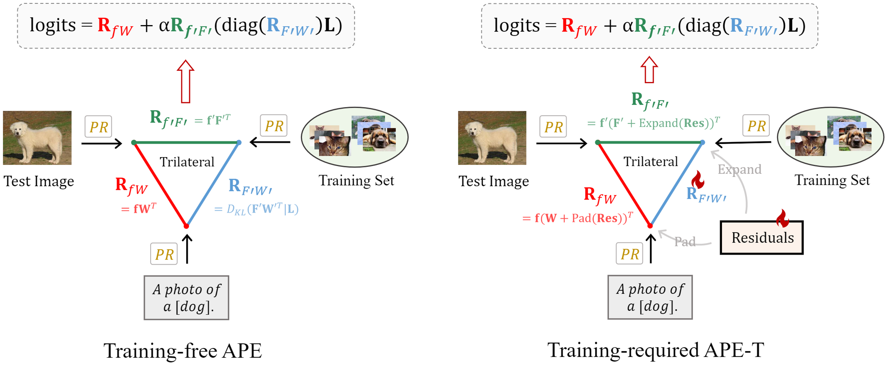

# APE

Implementation of  [Not All Features Matter:Enhancing Few-shot CLIP with Adaptive Prior Refinement](https://arxiv.org/abs/2304.01195), a few-shot framework designed for CLIP and other vision-language models.

## Introduction
**A**daptive **P**rior r**E**finement (**APE**) is a new method for few-shot CLIP, which achieves superior accuracy with high computational efficiency. Via a prior refinement module, we analyze the inter-class disparity in the downstream data and decouple the domain-specific knowledge from the CLIP-extracted cache model. On top of that, we introduce two model variants, a training-free APE and a training-required APE-T. We explore the trilateral affinities between the test image, prior cache model, and textual representations, and only enable a lightweight category-residual module to be trained. For the average accuracy over 11 benchmarks, both APE and APE-T attain SOTA.

<div align="center">
  
</div>

## Requirements
### Installation
Create a conda environment and install dependencies:
```
conda create -n APE python=3.7
conda activate APE

pip install -r requirements.txt

# Install the according versions of torch and torchvision
conda install pytorch torchvision cudatoolkit
```

### Dataset
Follow [DATASET.md](https://github.com/gaopengcuhk/Tip-Adapter/blob/main/DATASET.md) to install ImageNet and other 10 datasets referring to CoOp.

## Get Started
In this code, we seperate the feature extraction and model inference. The features should be extracted first, then conduct model inference.

### Extracting Features
We recommend users directly download the features from this [google drive](https://drive.google.com/drive/folders/196KIUYjjCmccn5fuH_ztO55FLzOAIT9_?usp=sharing).

After setting up the datasets and downloading the features, the project root folder should look like this:
```
APE/
|–– caches
|–––– caltech101
|–––– dtd
|–––– eurosat
|–––– ... 8 other datasets' features
|–– clip
|–– configs
|–– data
|–––– caltech101
|–––– ... 10 other datasets
|–– datasets
|–––– caltech101.yaml
|–––– ... 10 other yamls
|–– gpt3_prompts
|–––– CuPL_prompts_caltech101.json
|–––– ... 10 other dataset json files
|–– extract_features.py
|–– main.py
|–– utils.py
|–– README.md
```

Or you can extract the features by youself by running 
```bash 
CUDA_VISIBLE_DEVICES=0 python extract_features.py
```
to extract the features of all 11 datasets. Including the few-shot training set representation, validation and test set representation, and textual representation.

### Trying APE and APE-T
By running
```bash 
CUDA_VISIBLE_DEVICES=0 python main.py --config configs/[dataset_name].yaml --shot [shot_number]
```
users can test the proposed APE and APE-T, where you can change the `dataset_name` and `shot_number`. `dataset_name` should be one of `[caltech101, dtd, eurosat, fgvc, food101, imagenet, oxford_flowers, oxford_pets, stanford_cars, sun397, ucf101]`, and `shot_number` is chosen from 1/2/4/8/16.

The detailed results are provided in [APE_results](https://github.com/yangyangyang127/APE/blob/main/APE_results.ipynb) file.


## Acknowledgements
We build on several previous well-maintained repositories like [TIP-Adapter](https://github.com/gaopengcuhk/Tip-Adapter/), [CLIP](https://github.com/openai/CLIP/tree/main/clip), and [CoOp](https://github.com/KaiyangZhou/CoOp/), [SuS-X](https://github.com/vishaal27/SuS-X), and [CuPL](https://github.com/sarahpratt/CuPL). We thank the authors for providing such amazing code, and enabling further research towards better vision-language model adaptation.

## Reference

Not All Features Matter:Enhancing Few-shot CLIP with Adaptive Prior Refinement

```
@misc{zhu2023features,
      title={Not All Features Matter: Enhancing Few-shot CLIP with Adaptive Prior Refinement}, 
      author={Xiangyang Zhu and Renrui Zhang and Bowei He and Aojun Zhou and Dong Wang and Bin Zhao and Peng Gao},
      year={2023},
      eprint={2304.01195},
      archivePrefix={arXiv},
      primaryClass={cs.CV}
}
```
